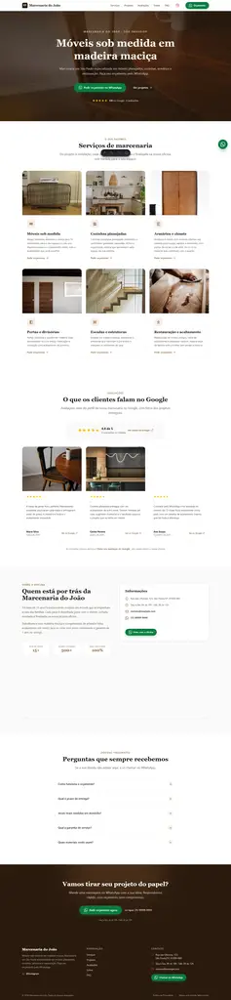
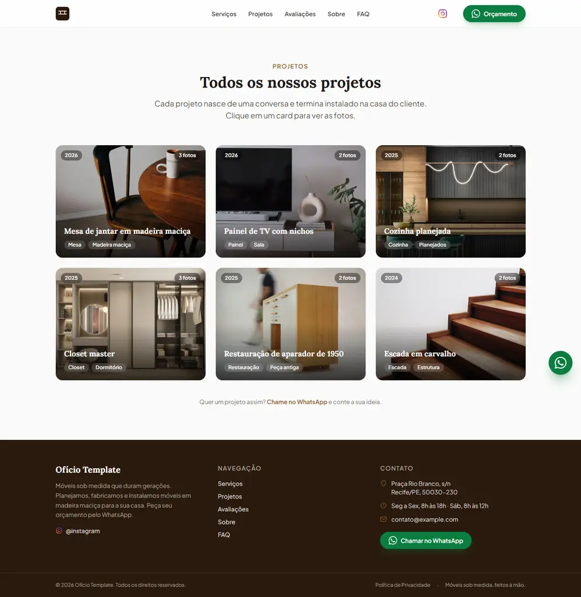

# Ofício

**Um site profissional para quem vive do próprio trabalho.** Template completo de site
para prestadores de serviço: marcenarias, encanadores, eletricistas, reformas e
qualquer negócio que venda serviço. Feito para ser entregue a clientes reais, com
conteúdo editável em Markdown e dados centralizados em um único arquivo.

[](https://astro.build)
[](https://tailwindcss.com)
[](https://bun.sh)
[](LICENSE)

## O que é

Um produto de site estático construído para resolver um problema real: pequenos
negócios de serviço precisam de presença online profissional, mas não têm tempo (nem
orçamento) para um site sob medida do zero. Este template entrega isso em um pacote
que qualquer pessoa consegue adaptar em minutos.

- **Para o cliente:** um site rápido, bonito e focado em conversão, com botão de
  WhatsApp em todo lugar, avaliações do Google e galeria de projetos.
- **Para o dev:** um codebase limpo, documentado e 100% estático, sem banco, sem
  backend, quase sem JavaScript no navegador. Deploy em qualquer lugar.

## Screenshots

| Home | Página de projetos |
| --- | --- |
|  |  |

## O que o site entrega

- **Conversão direta para WhatsApp** — botão flutuante, no header, no hero e em cada
  serviço e projeto, com mensagem pré-preenchida por contexto ("Olá! Quero um
  orçamento para cozinhas planejadas."). Sem formulário, sem backend, sem custo.
- **Página de projetos com galeria e lightbox** — um card por projeto, várias fotos
  por projeto, navegação entre fotos e CTA de orçamento dentro do lightbox.
- **Avaliações do Google com curadoria** — a home mostra apenas as melhores
  avaliações (flag `featured`), com a foto do projeto citado.
- **Seção Sobre com mapa** — Google Maps embutido a partir do endereço da
  configuração; o pin acompanha o endereço do cliente automaticamente.
- **Política de privacidade em conformidade com a LGPD** — página pronta, incluindo
  direitos do titular e tratamento de imagens.
- **SEO estruturado** — JSON-LD com `LocalBusiness`, `aggregateRating`, `Review` e
  `FAQPage` para rich results no Google, sitemap automático, Open Graph.
- **Performance** — site 100% estático, ~0 JavaScript no navegador, imagens
  otimizadas pelo Astro e fontes self-hosted (sem request a terceiros, sem cookies
  de rastreamento).

## Stack

| Camada | Escolha | Por quê |
| --- | --- | --- |
| Framework | **Astro 7** | Gera HTML estático com ~0 JS; content collections validam o conteúdo |
| Estilo | **Tailwind CSS 4** | Design system rápido e consistente via tokens CSS |
| Runtime | **Bun** | Instalação e build muito mais rápidos que npm |
| Fontes | **Lora + Plus Jakarta Sans** | Self-hosted via @fontsource; visual artesanal e legível sem dependência externa |
| SEO | **@astrojs/sitemap** | sitemap.xml gerado no build |

## Como rodar

```sh
bun install
bun run dev       # desenvolvimento em http://localhost:4321
bun run build     # gera o site estático em dist/
bun run preview   # serve o build localmente
```

## Personalização para um cliente (~30 minutos)

Tudo que muda de negócio para negócio está em 2 lugares:

1. **`src/config/site.ts`** — nome, tagline, WhatsApp, endereço, horário, Instagram,
   cores da marca, textos, estatísticas e FAQ. Um único arquivo.
2. **`src/content/`** — conteúdo em Markdown:
   - `services/` — serviços (título, ícone, foto, descrição);
   - `portfolio/` — projetos (várias fotos por projeto, tags, ano);
   - `reviews/` — avaliações do Google (`featured: true` define o que aparece na home).

A ordem das seções da home é definida em `src/pages/index.astro`.

## Estrutura

```
src/
├── config/site.ts              ← dados do cliente (o que muda)
├── content.config.ts           ← schemas das collections (validação)
├── content/                    ← serviços, projetos e avaliações (md + fotos)
├── lib/                        ← helpers (WhatsApp, formatação)
├── components/
│   ├── ui/                     ← Icon, Stars, WhatsAppButton, SectionHeading
│   ├── sections/               ← Hero, Servicos, Avaliacoes, Sobre, Faq, CTA
│   ├── Navbar.astro
│   ├── Footer.astro
│   ├── FloatingWhatsApp.astro  ← botão fixo do WhatsApp
│   └── BackToTop.astro         ← botão voltar ao topo
├── layouts/Base.astro          ← head SEO + JSON-LD + cores do cliente
└── pages/                      ← index (home), projetos, privacidade e 404
```

## Deploy

### Coolify (VPS própria)

O repositório inclui um [`Dockerfile`](Dockerfile) multi-stage que fixa a versão do
Bun (1.3.14), builda o site e serve com Nginx. No Coolify:

1. **Create New Resource** → **Public Repository** → cole a URL do repositório.
2. Build Pack: **Dockerfile**.
3. Defina o domínio e clique em **Deploy**.

O Dockerfile é detectado automaticamente e o site rebuila a cada push.

### Outros provedores

- **Netlify** — build `bun run build`, publish directory `dist`
- **Vercel** — framework preset Astro, output `dist`
- **Cloudflare Pages** — build `bun run build`, output `dist`

## LGPD

Política de privacidade pronta em `src/pages/privacidade.astro`: o site não coleta
dados automaticamente (sem formulários, sem cookies de rastreamento), as conversas
acontecem no WhatsApp do cliente e fotos/depoimentos são publicados somente com
consentimento.

## Créditos

Fotos de exemplo do [Unsplash](https://unsplash.com) (licença livre para uso
comercial). Substitua pelas fotos reais dos trabalhos do cliente, com autorização de
uso de imagem.

## Licença

[MIT](LICENSE) © 2026 Cluyverth Pereira
